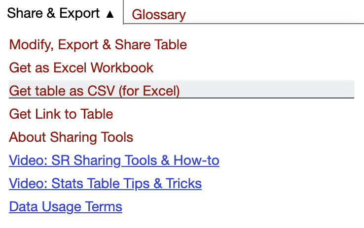
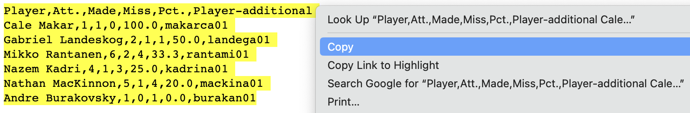

---
output:
  pdf_document: default
  html_document: default
---
```{r, echo=F, message=F,warning=F}
library(tidyverse)
library(kableExtra)
knitr::opts_chunk$set(tidy=FALSE)

# kable table global setup
kt <- function(data) {
  knitr::kable(data, digits=3, align=c('l','c','c','c','c','c','c','c','c')) %>% kable_styling(bootstrap_options='striped', latex_options='HOLD_position', full_width = F, position = "center")
}
```

# Data Acquisition 

There are many ways to acquire sports data to analyze in R. These include:

- Manually typing data into a spreadsheet
- Downloading pre-formatted tabular data from [(https://www.sports-reference.com/)](https://www.sports-reference.com/)
- Downloading datasets from various internet sources
- Importing data using R libraries
- Scraping data from internet websites

This chapter will explore these various methods of acquiring data and will also review data visualization and summaries. We will typically use `ggplot` for visualization and `kable` for data tables. [The R Graph Gallery (http://r-graph-gallery.com/)](http://r-graph-gallery.com/) is a nice resource for visualizations using `ggplot`.

## Tabular Data From Sports Reference

All tabular data on [Sports Reference (https://www.sports-reference.com/)](https://www.sports-reference.com/) can be easily downloaded though a little bit of data wrangling and cleaning is required to prepare the data.

Once you have navigated to the page that you want to download data from, click **Share & Export**, and select **Get table as CSV (for Excel)**. This will generate comma-separated data that you can copy and paste into your favorite text editor. 

{width=40%}

{width=80%}

\newpage

:::{.example}
Acquire the **Scoring Regular Season** dataset for the Colorado Avalanche 2021--2022 season.

This data is located on this webpage:
[https://www.hockey-reference.com/teams/COL/2022.html](https://www.hockey-reference.com/teams/COL/2022.html).

Once the data has been collected, using data wrangling and cleaning methods to transform the dataset into an easier to use format. Use this dataset to explore the relationship between goals, assists, OPS (offensive point shares), and DPS (defensive point shares).
:::

```{r,message=F} 
# Load data after collection
avs21 <- read_csv("data/avs21.csv")

# Take a look at the first five rows and first five columns
avs21 %>% slice_head(n=5) %>% select(1:5) %>% kable(booktabs=T)
```

```{r,message=F} 
# Remove unnecessary first row during loading
avs21 <- read_csv("data/avs21.csv",skip = 1)

# Select columns of interest
avs21 <- avs21 %>% select(Player,G,A,OPS)

# Take a look at the first five rows
avs21 %>% slice_head(n=5) %>% kable(booktabs=T)
```

\newpage

```{r}
# Make sure to eliminate any extra rows like "Team Totals"
avs21 <- avs21 %>% slice(1:n()-1)

# Let's also remove all players that did not have a goal and an assist
avs21 <- avs21 %>% filter(G>0 & A >0)
```

***Histogram***

```{r}
avs21 %>% ggplot(aes(x=G)) + geom_histogram(binwidth = 2,color="white",fill="steelblue") + 
  labs(x="Goals",y="Count",title="Colorado Avalanche Player Goal Counts, 2021-2022 season")
```

\newpage

***Density plot***

```{r}
avs21 %>% ggplot(aes(x=OPS)) + geom_density(fill="#6F263D") + 
  labs(x="Offensive Point Shares (OPS)",y="Density",title="Colorado Avalanche Player OPS Density, 2021-2022 season")
```

\newpage

***Scatterplot with Linear Fit***

```{r,message=F}
avs21 %>% ggplot(aes(x=G,y=OPS)) + geom_point() +
  geom_smooth(method=lm , fill="steelblue", color="#6F263D", se=TRUE) +
  labs(x="Goals",y="Offensive Point Shares (OPS)",title="Colorado Avalanche Player Goals and OPS, 2021-2022 season")
```

\newpage

***Scatterplot with LOESS Smoother***

```{r,message=F}
avs21 %>% ggplot(aes(x=A,y=OPS)) + geom_point(alpha=0.8,color="steelblue") +
  geom_smooth(method=loess, color="#6F263D", se=FALSE) +
  labs(x="Assists",y="Offensive Point Shares (DPS)",title="Colorado Avalanche Player OPS and DPS, 2021-2022 season")
```

\newpage

***Correlation Matrix Plot***

```{r}
library(GGally)
avs21 %>% select(-Player) %>% ggpairs()
```

\newpage

## Downloading Datasets From Internet

We can directly download datasets from the internet if we have a valid url to the datset.

:::{.example}
Game-by-game data for the CSU volleyball team is available at: [https://aaron-nielsen.github.io/csu_volleyball.csv](https://aaron-nielsen.github.io/csu_volleyball.csv)

Download this data and create some visualizations.
:::

```{r}
# Load data from URL
url <- "https://aaron-nielsen.github.io/csu_volleyball.csv"
csu_vb = read_csv(url,show_col_types = F)

# Look at first ten rows and columns
csu_vb %>% select(1:10) %>% slice(1:10) %>% kable(booktabs=T)
```

\newpage

***Correlogram***

```{r,message=F}
# Example adapted from: http://r-graph-gallery.com/97-correlation-ellipses.html
# Libraries
library(ellipse)
library(RColorBrewer)

# Use of the mtcars data proposed by R
data <- csu_vb %>% select(-(1:3)) %>% cor()

# Build a Pannel of 100 colors with Rcolor Brewer
my_colors <- brewer.pal(5, "Spectral")
my_colors <- colorRampPalette(my_colors)(100)

# Order the correlation matrix
ord <- order(data[1, ])
data_ord <- data[ord, ord]
plotcorr(data_ord, col=my_colors[data_ord*50+50], mar=c(1,1,1,1))
```

\newpage

***Correlation Matrix Plot***

```{r}
csu_vb %>% select(-(1:3)) %>% 
  ggcorr(method = c("everything", "pearson"))
```

\newpage

***Boxplot***

```{r}
csu_vb %>% 
  ggplot(aes(x=`W/L`, y=PCT, fill=`W/L`)) + 
  geom_boxplot(alpha=0.3) +
  theme(legend.position="none") +
  labs(x="Match Result",y="Hitting Percentage") +
  scale_x_discrete(limits = c("W", "L"),labels=c("Wins","Losses"))
```

\newpage

***Violin Plot***

```{r}
csu_vb %>% ggplot(aes(x=`W/L`, y=PCT, fill=`W/L`)) + 
  geom_violin() +
  labs(x="Match Result",y="Hitting Percentage") +
  scale_x_discrete(limits = c("W", "L"),labels=c("Wins","Losses")) + 
  theme(legend.position="none")
```

\newpage

## Importing Data Using R Libraries

### BaseballR package

The `baseballr` package allows for scraping data from Baseball Reference, Fangraphs, and Baseball Savant.

For more information, visit: [https://billpetti.github.io/baseballr/](https://billpetti.github.io/baseballr/)

:::{.example}
Use the `baseballr` package to obtain game results for the Colorado Rockies in 2022. Create a Kable Table of the first 20 games.
:::

```{r,cache=T}
library(baseballr)

# Scrape data from Baseball Reference
rox22 <- bref_team_results("COL", 2022)

# Select relevant columns and display first 20 games
rox22 %>% 
  select(Date,H_A,Opp,Result,R,RA,Time,Attendance) %>% 
  slice(1:20) %>% kable(booktabs=T)
```

\newpage

:::{.example}
Use the `baseballr` packges to obtain the batting leaderboards for MLB in 2022. Create a table with the top ten players in terms of WAR.
:::

```{r,cache=T}
# Scrape data from Fangraphs
bat22 <- fg_batter_leaders(x = 2022, y = 2022)

# Select relevant columns
bat22 = bat22 %>% 
  select(Name,Team,OPS,WPA,wRC,WAR)

# Arrange by leaders in WAR and print to a Kable table
bat22 %>% 
  arrange(desc(WAR)) %>% 
  slice(1:10) %>% 
  kable(booktabs=T)
```

\newpage

:::{.example}
Using the `baseballr` package, obtain the top ten leaders for max hit speed along with these players average hit speed, number of barrels, and barrel percent. Present this information in a Kable table.
:::

```{r, cache=T}
# Scrape Statcast data from Baseball Savant
sc_leader <- statcast_leaderboards(leaderboard = "exit_velocity_barrels",year = 2022)

# Select relevant columns
sc_leader %>% 
  mutate(Name = paste(first_name, last_name),
         `Max Hit Speed` = max_hit_speed,
         `Avg Hit Speed` = avg_hit_speed,
         `Barrels` = barrels,
         `Barrel Percent` = brl_percent) %>%
  select(Name,`Max Hit Speed`,`Avg Hit Speed`,`Barrels`,`Barrel Percent`) %>%
  arrange(desc(`Max Hit Speed`)) %>% slice(1:10) %>% kable(booktabs=T)

```

\newpage

This is a useful website for obtaining and visualizing StatCast pitch data: \
[https://billpetti.github.io/baseballr/articles/using_statcast_pitch_data.html](https://billpetti.github.io/baseballr/articles/using_statcast_pitch_data.html)

:::{.example}
Obtain Shohei Ohtani's pitch data for the 2022 season. Plot the horizontal and vertical break of the pitches. Also, investigate his fastball velocity by inning.

More about Ohtani's pitching repertoire: [https://www.youtube.com/watch?v=7nZBlYIqEww](https://www.youtube.com/watch?v=7nZBlYIqEww)
:::

```{r}
# This follows the example at: 
# https://billpetti.github.io/baseballr/articles/using_statcast_pitch_data.html

# ohtani_id <- baseballr::playerid_lookup(last_name = "Ohtani", first_name = "Shohei") %>% 
#   pull(mlbam_id)

# can get player id for mlbam at: https://razzball.com/mlbamids/
ohtani_id <- "660271"
ohtani_data <- baseballr::statcast_search_pitchers(start_date = "2022-03-01",
                                                   end_date = "2022-12-01",
                                                   pitcherid = "660271")
ohtani_cleaned_data <- ohtani_data %>% 
  # Only keep rows with pitch movement readings
  # and during the regular season
  filter(!is.na(pfx_x), !is.na(pfx_z),
         game_type == "R") %>% 
  mutate(pfx_x_in_pv = -12*pfx_x,
         pfx_z_in = 12*pfx_z)

colors <- brewer.pal(n = 12, name = "Paired")
pitch_colors <- c("4-Seam Fastball" = colors[1],
                  "2-Seam Fastball" = colors[2],
                  "Sinker" = colors[3],
                  "Cutter" = colors[4],
                  "Fastball" = colors[5],
                  "Curveball" = colors[6],
                  "Knuckle Curve" = colors[7],
                  "Slider" = colors[8],
                  "Changeup" = colors[9],
                  "Split-Finger" = colors[10],
                  "Knuckleball" = colors[11])

( ohtani_pitch_types <- unique(ohtani_cleaned_data$pitch_name) )
```

\newpage

```{r,warning=F,message=F}
ohtani_cleaned_data %>% 
  ggplot(aes(x = pfx_x_in_pv, y = pfx_z_in, color = pitch_name)) +
  geom_vline(xintercept = 0) +
  geom_hline(yintercept = 0) +
  geom_point(size = 1.5, alpha = 0.5) +
  scale_color_manual(values = pitch_colors,
                     limits = ohtani_pitch_types) +
  scale_x_continuous(limits = c(-25,25),
                     breaks = seq(-20,20, 5),
                     labels = scales::number_format(suffix = "\"")) +
  scale_y_continuous(limits = c(-25,25),
                     breaks = seq(-20,20, 5),
                     labels = scales::number_format(suffix = "\"")) +
  coord_equal() +
  labs(title = "Shohei Ohtani Pitch Movement",
       subtitle = "2022 MLB Season | Pitcher's POV",
       caption = "Data: Baseball Savant via baseballr", 
       x = "Horizontal Break",
       y = "Induced Vertical Break",
       color = "Pitch Name")
```

\newpage

```{r, message=F}
# Group pitches by inning
ohtani_velo_by_inning <- ohtani_cleaned_data %>% 
  filter(pitch_name == "4-Seam Fastball") %>% 
  group_by(inning, pitch_name) %>% 
  summarize(average_velo = mean(release_speed, na.rm = TRUE))

# Plot average fastball speed by inning
ohtani_velo_by_inning %>% 
  ggplot(aes(x = inning, y = average_velo, color = pitch_name)) +
  geom_line(linewidth = 1.5, alpha = 0.5, show.legend = FALSE) +
  geom_point(size = 3, show.legend = FALSE) +
  scale_color_manual(values = pitch_colors) +
  scale_x_continuous(breaks = 1:9) +
  scale_y_continuous(limits = c(90, 100)) +
  labs(title = "Shohei Ohtani 4-Seam Fastball Velo By Inning",
       subtitle = "2022 MLB Season",
       caption = "Data: Baseball Savant via baseballr",
       x = "Inning",
       y = "Average Velo")
```

\newpage

### nflfastR package

The `nflfastR` package is a helpful package for obtaining play-by-play and roster data for NFL games.

For more details, see: [https://www.nflfastr.com/articles/nflfastR.html](https://www.nflfastr.com/articles/nflfastR.html)

:::{.example}
Use the `nflfastR` package to obtain the play-by-play data for the Denver Broncos home game against the San Francisco 49ers during the 2022 season.
:::

```{r,message=F,warning=F,cache=T}
library(nflfastR)
library(gsisdecoder)
# First find the game ID by searching Broncos home games in 2022
fast_scraper_schedules(2022) %>%
  filter(home_team=="DEN") %>%
  select(game_id,gameday,away_team,home_team) %>%
  kable(booktabs=T)
```

\newpage

```{r,message=F,warning=F,cache=T}
# Scrape data for the specific game and display play-by-play data
fast_scraper("2022_03_SF_DEN") %>%
  clean_pbp() %>%
  select(desc, play_type, ep, epa, home_wp) %>%
  head(10) %>%
  kable(booktabs=T,digits = 3) %>%
  column_spec(1, width = "3.5in")
```

\newpage

```{r,warning=F,message=F}
library(nflplotR)
# Example from: https://www.nflfastr.com/articles/nflfastR.html
pbp <- nflfastR::load_pbp(2022) %>%
  filter(season_type == "REG") %>%
  filter(!is.na(posteam) & (rush == 1 | pass == 1))
offense <- pbp %>% group_by(team = posteam) %>%
  summarise(off_epa = mean(epa, na.rm = TRUE))
defense <- pbp %>% group_by(team = defteam) %>% 
  summarise(def_epa = mean(epa, na.rm = TRUE))
offense %>%
  inner_join(defense, by = "team") %>%
  ggplot(aes(x = off_epa, y = def_epa)) +
  geom_abline(slope = -1.5, intercept = c(.4, .3, .2, .1, 0, -.1, -.2, -.3), alpha = .2) +
  geom_mean_lines(aes(h_var = off_epa, v_var = def_epa)) +
  geom_nfl_logos(aes(team_abbr = team), width = 0.07, alpha = 0.7) +
  labs(x = "Offense EPA/play", y = "Defense EPA/play", caption = "Data: @nflfastR",
    title = "2022 NFL Offensive and Defensive EPA per Play") +
  theme_bw() +
  theme( plot.title = element_text(size = 12, hjust = 0.5, face = "bold") ) +
  scale_y_reverse()
```

\newpage

### hoopR package

The `hoopR` allows for one to access data related to professional and college basketball.

:::{.example}
Using the `hoopR` package, obtain the play-by-play data for the Denver Nuggets vs. Philadelphia 76ers game on January 28, 2023.
:::

```{r}
library(hoopR)
# https://www.espn.com/nba/game/_/gameId/401468896
hoopR::espn_nba_pbp(game_id = 401468896) %>% 
  select(`Description`=text,`Play Type`=type_text,
         Quarter=period_display_value,Points=score_value,Clock=clock_display_value) %>%
  slice(1:15) %>%
  kable(booktabs=T) %>%
  column_spec(1, width = "3in") %>%
  column_spec(2, width = "1in")
```

\newpage

:::{.example}
Obtain win probability as a function of game time for Colorado State vs. Boise State men's basketball on January 28, 2023.
:::

```{r}
# Get ID from ESPN game URL: https://www.espn.com/mens-college-basketball/game/_/gameId/401482835
library(hoopR)
hoopR::espn_mbb_wp(game_id = 401482835) %>%
  select(Period=period,`Seconds Remaining`=game_seconds_left,`Home Win Pct`=home_win_percentage,`Play ID`=play_id) %>%
  slice(1:10) %>%
  kable(booktabs=T)
```

\newpage

```{r}
library(ncaahoopR)
wp_chart_new(401482835,show_labels = F)
```
\newpage

```{r}
game_flow(game_id = 401482835, home_col = "blue", away_col = "forestgreen")
```