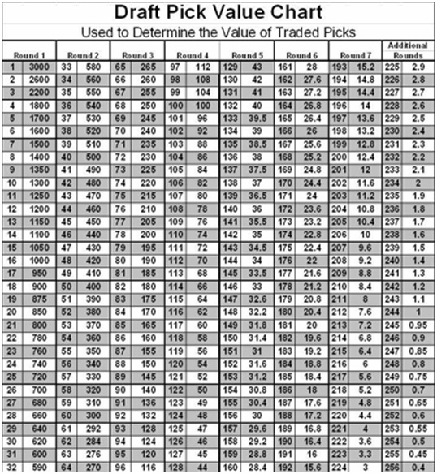

---
output:
  pdf_document: default
  html_document: default
---
```{r, echo=F, message=F,warning=F}
library(tidyverse)
library(kableExtra)
library(knitr)
knitr::opts_chunk$set(tidy=FALSE,message=F,warning=F)

# kable table global setup
kt <- function(data) {
  knitr::kable(data, digits=3, align=c('l','c','c','c','c','c','c','c','c')) %>% kable_styling(bootstrap_options='striped', latex_options='HOLD_position', full_width = F, position = "center")
}
```


# Sports Drafts

## NFL Draft

**Details about the NFL Draft**

- Seven rounds, one pick per team per round (generally)
- Can trade draft picks (including future draft picks)
- Draft order is based on previous year's win-loss record
- This year's draft: Thursday, April 27, 6pm MDT


**YouTube video: Evolution of the NFL Draft:** \
https://youtu.be/Uin_eoSXzmY


\newpage

## Draft Pick Value Chart

The draft pick value chart was developed by the Dallas Cowboys in the late 80s.

**YouTube video: The Value Chart That Changed The Way NFL Teams Draft:** \
https://youtu.be/U2FEjzqtgWY


**YouTube video: How To Better Understand NFL Draft Trade** \
https://youtu.be/oBF2iUa0oeo




\newpage

## NFL Combine

**YouTube video: NFL 101: The Combine** \
https://youtu.be/62YWPRII_YY

**Note:** The following analysis and dataset are provided in *Sports Analytics in Practice with R* by Ted Kwartler (2022) \

:::{.example}
NFL Combine results for 2000-2020 are provided in `nfl_combine_2000_2000.csv`. This exercise will explore some characteristics of this dataset.
:::

(a) Load the data and look at the first five entries.

```{r}
combine <- read_csv("data/nfl_combine_2000_2020.csv")
names(combine)
combine %>% slice_head(n=5) %>% select(1:8) %>% kable(booktabs=T)
```

```{r}
combine %>% slice_head(n=5) %>% select(-(3:8)) %>% kable(booktabs=T)
```

\newpage

(b) Create a table that displays the number of players drafted and not drafted by position.

```{r}
combine$Drafted <- ifelse(is.na(combine$Round),"No","Yes")
drafted_table <- as.data.frame.matrix(table(combine$Pos,combine$Drafted))
drafted_table$Pos <- rownames(drafted_table)
colnames(drafted_table) <- c("NotDrafted","Drafted","Pos")
rownames(drafted_table) <- NULL
drafted_table <- drafted_table %>% relocate("Pos",.before = "NotDrafted")
drafted_table %>% kable(booktabs=T)
```

\newpage

(c) Remove rows for generic positions that didn't have any draftees.

```{r}
drafted_table <- drafted_table %>% filter(Drafted > 0 & NotDrafted > 0)
drafted_table %>% kable(booktabs=T)
```

\newpage

(d) Create a stacked bar plot to display the number of drafted and not drafted players by position.

```{r}
long_drafted <- pivot_longer(drafted_table,cols=-Pos)
long_drafted$Pos <- factor(long_drafted$Pos)
ggplot(long_drafted, aes(x=Pos,y=value,fill=name)) + geom_col() +
  ggtitle("Draft Breakdown by Position") + 
  scale_fill_discrete(name = "Draft Status")
```

\newpage

(e) Calculate the average 40-yard dash for the following positions broken down by drafted status: QB, RB, WR, OT, P.

```{r}
forty <- aggregate(Forty~Pos+Drafted,data=combine,FUN="mean") %>% 
  filter(Pos == "QB" | Pos == "RB" | Pos == "WR" | Pos == "OT" | Pos == "P")
forty <- forty[order(forty$Pos),]
rownames(forty) = NULL
forty %>% kable(booktabs=T,linesep="")
```

(f) Plot the data in the previous table using ggplot and a facet for drafted status.

```{r,fig.height=3}
ggplot(forty, aes(x=Pos, y=Forty))+
  geom_bar(stat='identity')+
  facet_wrap(~Drafted,  ncol=2) +
  labs(x="Position",y="Average 40-Yard Dash",title="Average 40-Yard Dash by Position and Drafted Status")
```

\newpage

(g) Subset the quarterbacks and output the first ten observations to a kable table.

```{r}
qb <- combine %>% filter(Pos == "QB")
qb %>% select(1:6,8:10,15) %>% slice_head(n=10) %>% kable(booktabs=T,linesep="")
```


(h) For the quarterbacks subset, investigate the relationship between the quantitative variables.

```{r,message=F,warning=F}
library(GGally)
qb %>% select(3,4,5,6,8,9,10) %>% ggpairs()
```

\newpage

# Clustering

# Principal Component Analysis

# Nonparametric Methods

# Baseball

# Football

# Basketball

# Hockey

# Soccer